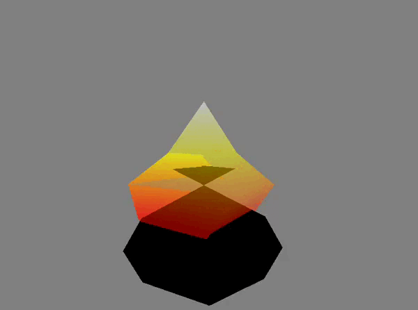

# Feu_de_poubelle_GL4D
Petit programme C pour faire une poubelle en feu lopoly /GL4D.
Ce projet est une partie de ma soumission pour le [concours API8](https://www.api8.fr/) 7ème édition, dans lequel j'ai remporté la 3ème place dans la track3 64ko.

## Bibliothèques utilisées
-   [GL4D](https://gl4d.api8.fr/FR/): Une bibliothèque en langage C basée sur OpenGL pour faciliter la création d'applications graphiques 2D et 3D.
-   [OpenGL](https://www.opengl.org/): Une spécification et une API (Application Programming Interface) pour la création d'applications graphiques 2D et 3D. Elle fournit des fonctionnalités avancées pour la programmation graphique, y compris la gestion des shaders, des textures, des lumières, etc.

## Utilisation
Pour exécuter ce programme, vous devez disposer des bibliothèques GL4D, GL4DP et gl4duw_SDL2. Assurez-vous d'avoir ces bibliothèques installées et correctement configurées avant de compiler et exécuter le programme.
### Execution 
Faire `$ make` lancer avec `./Feu` .
## Fonctionement 

Le feu de poubelle est représenté par une pyramide avec plusieurs étages. Chaque étage est dessiné à l'aide de sommets et d'indices spécifiés dans le tableau "data". Les sommets définissent la forme de la pyramide, tandis que les indices définissent les triangles formant les faces de la pyramide.

Le programme utilise également des shaders (fichiers "basic_feu.vs" et "basic_feu.fs") pour le rendu du feu de poubelle. Les shaders définissent comment les sommets et les fragments sont traités lors du rendu.

Le feu de poubelle est animé en faisant tourner la caméra autour de celui-ci. L'animation est réalisée en mettant à jour la matrice de vue à chaque itération de la boucle d'affichage.

## Image

